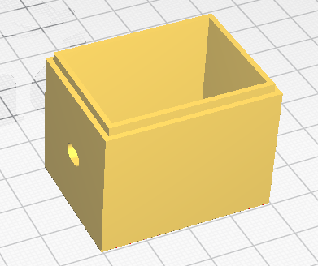

# 3D things

## 1. Chambers

### 1.1. 

### 1.2. 

### 1.3. 

### 1.4. 

### 1.5. 

### 1.6. 

### 1.7. 

### 1.8. 

### 1.9. 

## 2. Holders

### 2.1. 

### 2.2. 

## 3. Supports

### 3.1. 

### 3.2. 

### 3.3. 

### 3.4. 

## 4. MISC

### 4.1. 

### 4.2. 

### 4.3. 

### 4.4. 

### 4.5. 

### 4.6. 

### 4.7. 

### 4.8. 

### 4.9. 

### 4.10. 
.png)

### 4.11. 

.png)

